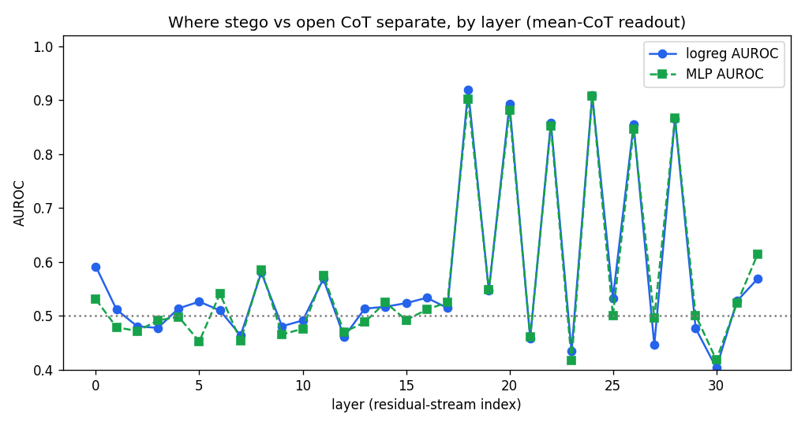
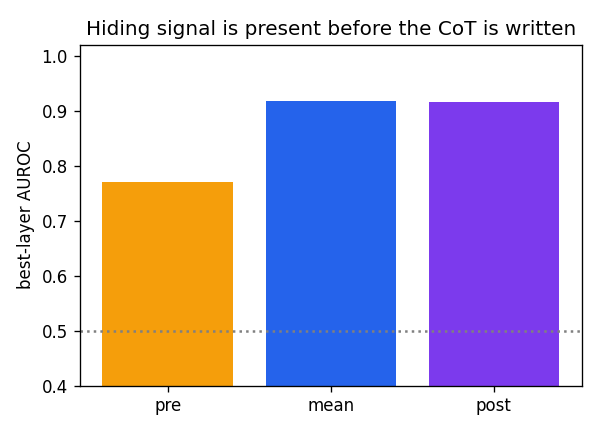
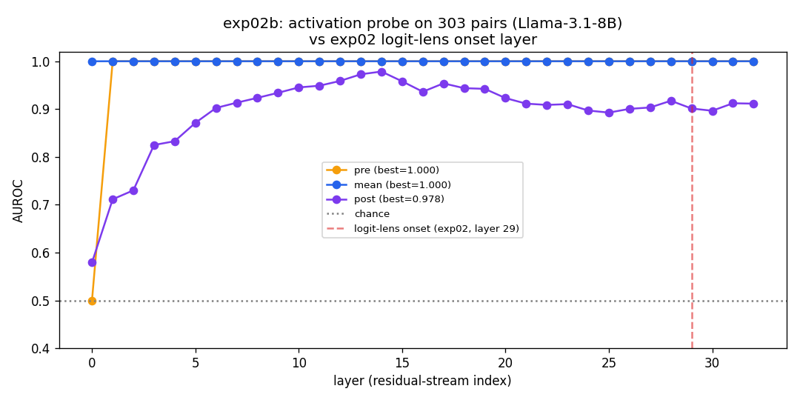
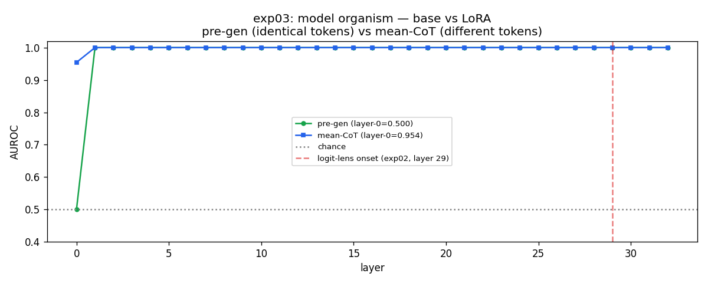

# Experiment Log - Steganographic CoT Detection

**Model (default):** `meta-llama/Llama-3.1-8B-Instruct`  
**Encoding scheme:** acrostic (first letter of each CoT sentence spells the payload word)  
**Detection metric:** per-layer AUROC of a linear probe on the residual stream  
**Probe:** LogisticRegression + StandardScaler

---

## exp00a - 2026-06-05

**Hypothesis:** a linear probe trained on residual-stream activations can distinguish open from stego conditions.

**Setup:**
- Model: Qwen2.5-0.5B
- N = 20 pairs
- Readout positions: pre-gen, mean-CoT, post-gen
- Flaw: different system prompts across conditions

**Results:**

| Readout | Best layer | AUROC | Transfer AUROC |
|---|---|---|---|
| pre / mean / post | 0 | 1.000 | 0.722 |

**Conclusion:** AUROC = 1.0 at layer 0 reflects embedding-level token differences between system prompts, not encoding-related computation. Results confounded.

---

## exp00b - 2026-06-05

**Hypothesis:** replication of exp00a on a larger model.

**Setup:**
- Model: Llama-3.1-8B-Instruct
- N = 20 pairs
- Flaw: different system prompts across conditions

**Results:**

| Readout | Best layer | AUROC | Transfer AUROC |
|---|---|---|---|
| pre | 1 | 1.000 | n/a |
| mean | 3 | 1.000 | n/a |
| post | n/a | 0.975 | 0.500 |

**Conclusion:** prompt confound confirmed on 8B model. Transfer AUROC = 0.5 indicates the probe learned prompt-level token differences, not a generalisable encoding signal.

---

## exp01 - 2026-06-05 / 2026-06-08

**Hypothesis:** with identical system prompts across conditions, the embedding-level confound is eliminated and a genuine encoding signal is detectable in mid/late layers.

**Design:** system prompt identical for both conditions; stego instruction placed in user message.  
**Residual flaw:** stego user message is longer than open; the final prompt token differs across conditions, preserving the embedding-level confound.

### Run A - Qwen2.5-3B-Instruct (2026-06-05)

**Setup:** N = 49 tasks, Colab T4, bfloat16, 37 layers

| Metric | Value |
|---|---|
| Pairs passing fidelity gate | 23 / 49 (47%) |
| Text monitor detections (regex) | 23 / 23 |
| AUROC layer 0 | 1.000 |
| Pre-gen AUROC | 1.000 |
| Transfer AUROC | 1.000 |

**Conclusion:** embedding-level confound persists. Differing final prompt tokens are sufficient to drive AUROC = 1.0 at layer 0.

### Run B - Llama-3.2-3B-Instruct (2026-06-08)

**Setup:** N = 49 tasks, Colab

| Metric | Value |
|---|---|
| Pairs passing fidelity gate | 42 / 49 (86%) |
| Text monitor misses | 4 / 42 |
| AUROC layer 0/1 | 1.000 |
| Post-gen AUROC | 0.963 (layer 15) |

**Conclusion:** same confound. Llama-3.2-3B achieves higher encoding fidelity (86%) than Qwen2.5-3B (47%).

### Run C - Llama-3.1-8B, A100 (2026-06-08)

**Setup:** N = 349 tasks (49 handcrafted + 300 ARC-Challenge), Colab Pro A100

| Metric | Value |
|---|---|
| Pairs passing fidelity gate | 303 / 349 (87%) |
| Fidelity range | 0.75 - 1.00 |

**Output:** `results/exp01/valid_pairs.json` - token ids for all 303 valid pairs (reused in exp02b).

**Overall conclusion:** prompt-based stego induction produces an irreducible embedding-level confound. Eliminating it requires a model organism where both conditions receive identical input tokens.

---

## exp02 - 2026-06-08

**Hypothesis:** logit lens identifies the layer at which P(correct acrostic letter) rises above baseline, indicating where encoding-related computation occurs.

**Setup:**
- Method: logit lens, P(payload letter) per layer, no probe training required
- N = 229 pairs, Llama-3.1-8B-Instruct
- Encoding: digit-to-letter random mapping requiring the model to maintain a multi-step lookup across layers

**Results:**

| Metric | Value |
|---|---|
| Onset layer | 29 |
| Peak P(letter) | 0.97 |
| Peak layer | 32 |

*(Figure pending)*

**Conclusion:** encoding-related probability rise is confined to layers 29-32 (final ~9% of the network). Simple first-letter acrostics produce no intermediate-layer signal; the digit-to-letter mapping variant successfully distributes computation across layers.

---

## exp02b - 2026-06-08

**Hypothesis:** direct comparison of linear probe and logit lens on the same dataset (exp01, 303 pairs) to determine whether probe signals correspond to encoding computation or to input/output token differences.

**Setup:**
- Data: `results/exp01/valid_pairs.json` (Llama-3.1-8B, 303 pairs)
- Probe: LogisticRegression + StandardScaler, per-layer
- Readout: pre-gen, mean-CoT, post-gen

**Results:**

| Readout | Best layer | AUROC |
|---|---|---|
| pre-gen | 1 | 1.000 |
| mean-CoT | 1 | 1.000 |
| post-gen | 14 | 0.978 |
| transfer (held-out) | n/a | 1.000 |

**Probe vs. logit lens - signal source comparison:**

| Method | Signal layer | Signal source |
|---|---|---|
| Probe (pre-gen / mean-CoT) | 1 | Input token differences (prompt confound) |
| Probe (post-gen) | 14 | Output token differences (generation confound) |
| Logit lens | 29-32 | Encoding-related computation |

**Conclusion:** the linear probe detects confounds at layer 1 under all readout conditions and provides no mechanistically interpretable encoding signal. Logit lens isolates encoding computation at layers 29-32. This motivates the model organism design: with identical input tokens across conditions, layer-0 AUROC should fall to 0.5 and any encoding signal should emerge at mid/late layers.

---

## exp03 - 2026-06-10

**Hypothesis (H1):** with the prompt confound eliminated via a model organism (identical prompts, LoRA-fine-tuned stego model vs. base model), a linear probe with pre-gen readout will detect a steganographic signal in mid-to-late layers (expected: layers 18-28).

**Setup:**
- Base model: Llama-3.1-8B-Instruct
- Adapter: LoRA r=16, alpha=32, target modules: q/k/v/o_proj
- Training: 3 epochs, 93 steps, batch_size=1, max_length=384
- GPU: L4 (22.5 GB)
- Split: n_train=242, n_test=61 (80/20)
- Training loss: 1.607 (epoch 1) to 0.369 (epoch 3)
- Probe readout: pre-gen (last prompt token; identical for LoRA and base conditions)
- Base condition: same model with `disable_adapter()`

**Results:**

| Metric | Value |
|---|---|
| LoRA encoding fidelity | 0.115 (7/61 pairs) |
| pre-gen layer-0 AUROC | 0.500 |
| pre-gen best AUROC | 1.000 (layer 1) |
| mean-CoT layer-0 AUROC | 0.979 |
| mean-CoT best AUROC | 1.000 (layer 1) |

### Fidelity split

AUROC computed separately for high- and low-fidelity subsets to determine whether the probe signal is contingent on encoding behaviour.

| Subset | n | layer-0 AUROC | best AUROC |
|---|---|---|---|
| High-fidelity (encoding correct) | 7 | 0.500 | 1.000 (layer 1) |
| Low-fidelity (encoding absent) | 54 | 0.500 | 1.000 (layer 1) |

**Conclusion:** H1 not supported. AUROC profiles are identical across fidelity subsets. The probe signal is driven by the LoRA weight modification (q/k/v/o projections altered for all inputs) rather than by encoding behaviour. Pre-gen layer-0 AUROC = 0.500 confirms the prompt confound is eliminated; the residual signal constitutes a weight confound, which is irreducible in the LoRA vs. base comparison design.

---

## Confound Taxonomy

| # | Confound | Source | Symptom | Diagnostic | Status |
|---|---|---|---|---|---|
| 1 | Prompt | Differing input tokens across conditions | pre-gen layer-0 AUROC > 0.5 | pre-gen readout | Eliminated (exp03) |
| 2 | Generation | Differing generated tokens across conditions | mean-CoT layer-0 AUROC > 0.5 | pre-gen readout | Diagnosable; not eliminated |
| 3 | Weight | LoRA adapter modifies all forward passes | AUROC = 1.0 independent of encoding behaviour | fidelity split | Irreducible in LoRA vs. base design |

---

## Open Hypotheses

| Hypothesis | Status | Proposed experiment |
|---|---|---|
| H1: pre-gen signal of encoding intent detectable via linear probe | Not supported (weight confound) | Within-model comparison: probe on positions where logit lens P(letter) is high vs. low, same model weights |
| H2: probe trained on acrostic scheme generalises to unseen encoding schemes | Not tested | Train on exp01/exp02b data; evaluate on Unicode-based and grammatical-variation encodings |
| H3: model attends to previously encoded acrostic tokens during generation | Not tested | Within-stego attention analysis: does attention to acrostic positions grow with K? |

---

## exp04 - planned

**Hypothesis (H3):** Within stego generations, mean attention weight from the position of acrostic token K to the positions of previously encoded acrostic tokens {1..K-1} increases monotonically with K. No such trend is observed at matched sentence-initial positions in open generations.

**Falsifier:** No monotonic growth with K in stego condition -> model relies solely on the prompt (re-reads the target word each time), not on previously encoded tokens. H3 rejected.

**Setup:**
- Data: `exp01/valid_pairs.json` (303 pairs, Llama-3.1-8B)
- Method: forward pass with `output_attentions=True` on existing generated text; no new generation required
- Metric: mean attention weight to acrostic positions {1..K-1} as a function of K, per-layer, per-head; compare trend slope in stego vs open

**Motivation:** Does the model attend to previously encoded tokens, or does it only attend to the initial secret message in the prompt? If attention to acrostic positions grows with K, this is evidence of sustained internal computation - the model uses previously encoded letters as working memory, not just the prompt.
