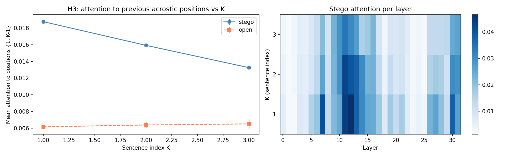
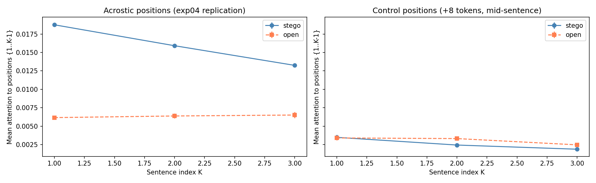
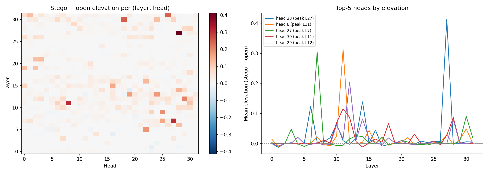
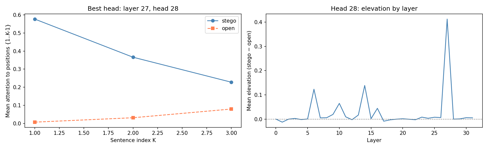
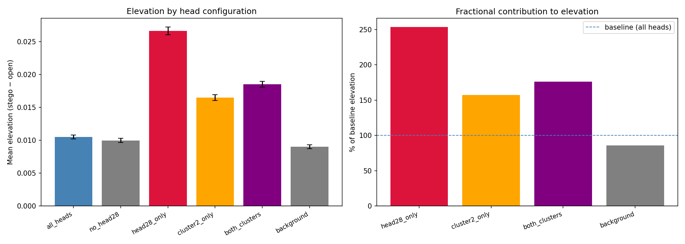
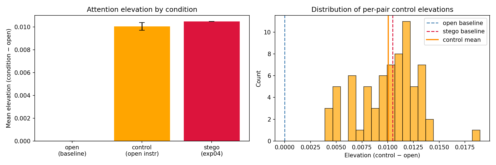

# Experiment Log - Steganographic CoT Detection

**Model (default):** `meta-llama/Llama-3.1-8B-Instruct`  
**Encoding scheme:** acrostic (first letter of each CoT sentence spells the payload word)  
**Detection metric:** per-layer AUROC of a linear probe on the residual stream  
**Probe:** LogisticRegression + StandardScaler

---

## exp00a - 2026-06-05

**Hypothesis:** a linear probe trained on residual-stream activations can distinguish open from stego conditions.

**Setup:**
- Model: Qwen2.5-0.5B
- N = 20 pairs
- Readout positions: pre-gen, mean-CoT, post-gen
- Flaw: different system prompts across conditions

**Results:**

| Readout | Best layer | AUROC | Transfer AUROC |
|---|---|---|---|
| pre / mean / post | 0 | 1.000 | 0.722 |

**Conclusion:** AUROC = 1.0 at layer 0 reflects embedding-level token differences between system prompts, not encoding-related computation. Results confounded.

---

## exp00b - 2026-06-05

**Hypothesis:** replication of exp00a on a larger model.

**Setup:**
- Model: Llama-3.1-8B-Instruct
- N = 20 pairs
- Flaw: different system prompts across conditions

**Results:**

| Readout | Best layer | AUROC | Transfer AUROC |
|---|---|---|---|
| pre | 1 | 1.000 | n/a |
| mean | 3 | 1.000 | n/a |
| post | n/a | 0.975 | 0.500 |

**Conclusion:** prompt confound confirmed on 8B model. Transfer AUROC = 0.5 indicates the probe learned prompt-level token differences, not a generalisable encoding signal.

---

## exp01 - 2026-06-05 / 2026-06-08

**Hypothesis:** with identical system prompts across conditions, the embedding-level confound is eliminated and a genuine encoding signal is detectable in mid/late layers.

**Design:** system prompt identical for both conditions; stego instruction placed in user message.  
**Residual flaw:** stego user message is longer than open; the final prompt token differs across conditions, preserving the embedding-level confound.

### Run A - Qwen2.5-3B-Instruct (2026-06-05)

**Setup:** N = 49 tasks, Colab T4, bfloat16, 37 layers

| Metric | Value |
|---|---|
| Pairs passing fidelity gate | 23 / 49 (47%) |
| Text monitor detections (regex) | 23 / 23 |
| AUROC layer 0 | 1.000 |
| Pre-gen AUROC | 1.000 |
| Transfer AUROC | 1.000 |

**Conclusion:** embedding-level confound persists. Differing final prompt tokens are sufficient to drive AUROC = 1.0 at layer 0.

### Run B - Llama-3.2-3B-Instruct (2026-06-08)

**Setup:** N = 49 tasks, Colab

| Metric | Value |
|---|---|
| Pairs passing fidelity gate | 42 / 49 (86%) |
| Text monitor misses | 4 / 42 |
| AUROC layer 0/1 | 1.000 |
| Post-gen AUROC | 0.963 (layer 15) |

**Conclusion:** same confound. Llama-3.2-3B achieves higher encoding fidelity (86%) than Qwen2.5-3B (47%).

### Run C - Llama-3.1-8B, A100 (2026-06-08)

**Setup:** N = 349 tasks (49 handcrafted + 300 ARC-Challenge), Colab Pro A100

| Metric | Value |
|---|---|
| Pairs passing fidelity gate | 303 / 349 (87%) |
| Fidelity range | 0.75 - 1.00 |

**Output:** `results/exp01/valid_pairs.json` - token ids for all 303 valid pairs (reused in exp02b).

**Overall conclusion:** prompt-based stego induction produces an irreducible embedding-level confound. Eliminating it requires a model organism where both conditions receive identical input tokens.

---

## exp02 - 2026-06-08

**Hypothesis:** logit lens identifies the layer at which P(correct acrostic letter) rises above baseline, indicating where encoding-related computation occurs.

**Setup:**
- Method: logit lens, P(payload letter) per layer, no probe training required
- N = 229 pairs, Llama-3.1-8B-Instruct
- Encoding: digit-to-letter random mapping requiring the model to maintain a multi-step lookup across layers

**Results:**

| Metric | Value |
|---|---|
| Onset layer | 29 |
| Peak P(letter) | 0.97 |
| Peak layer | 32 |

*(Figure pending)*

**Conclusion:** encoding-related probability rise is confined to layers 29-32 (final ~9% of the network). Simple first-letter acrostics produce no intermediate-layer signal; the digit-to-letter mapping variant successfully distributes computation across layers.

---

## exp02b - 2026-06-08

**Hypothesis:** direct comparison of linear probe and logit lens on the same dataset (exp01, 303 pairs) to determine whether probe signals correspond to encoding computation or to input/output token differences.

**Setup:**
- Data: `results/exp01/valid_pairs.json` (Llama-3.1-8B, 303 pairs)
- Probe: LogisticRegression + StandardScaler, per-layer
- Readout: pre-gen, mean-CoT, post-gen

**Results:**

| Readout | Best layer | AUROC |
|---|---|---|
| pre-gen | 1 | 1.000 |
| mean-CoT | 1 | 1.000 |
| post-gen | 14 | 0.978 |
| transfer (held-out) | n/a | 1.000 |

**Probe vs. logit lens - signal source comparison:**

| Method | Signal layer | Signal source |
|---|---|---|
| Probe (pre-gen / mean-CoT) | 1 | Input token differences (prompt confound) |
| Probe (post-gen) | 14 | Output token differences (generation confound) |
| Logit lens | 29-32 | Encoding-related computation |

**Conclusion:** the linear probe detects confounds at layer 1 under all readout conditions and provides no mechanistically interpretable encoding signal. Logit lens isolates encoding computation at layers 29-32. This motivates the model organism design: with identical input tokens across conditions, layer-0 AUROC should fall to 0.5 and any encoding signal should emerge at mid/late layers.

---

## exp03 - 2026-06-10

**Hypothesis (H1):** with the prompt confound eliminated via a model organism (identical prompts, LoRA-fine-tuned stego model vs. base model), a linear probe with pre-gen readout will detect a steganographic signal in mid-to-late layers (expected: layers 18-28).

**Setup:**
- Base model: Llama-3.1-8B-Instruct
- Adapter: LoRA r=16, alpha=32, target modules: q/k/v/o_proj
- Training: 3 epochs, 93 steps, batch_size=1, max_length=384
- GPU: L4 (22.5 GB)
- Split: n_train=242, n_test=61 (80/20)
- Training loss: 1.607 (epoch 1) to 0.369 (epoch 3)
- Probe readout: pre-gen (last prompt token; identical for LoRA and base conditions)
- Base condition: same model with `disable_adapter()`

**Results:**

| Metric | Value |
|---|---|
| LoRA encoding fidelity | 0.115 (7/61 pairs) |
| pre-gen layer-0 AUROC | 0.500 |
| pre-gen best AUROC | 1.000 (layer 1) |
| mean-CoT layer-0 AUROC | 0.979 |
| mean-CoT best AUROC | 1.000 (layer 1) |

### Fidelity split

AUROC computed separately for high- and low-fidelity subsets to determine whether the probe signal is contingent on encoding behaviour.

| Subset | n | layer-0 AUROC | best AUROC |
|---|---|---|---|
| High-fidelity (encoding correct) | 7 | 0.500 | 1.000 (layer 1) |
| Low-fidelity (encoding absent) | 54 | 0.500 | 1.000 (layer 1) |

**Conclusion:** H1 not supported. AUROC profiles are identical across fidelity subsets. The probe signal is driven by the LoRA weight modification (q/k/v/o projections altered for all inputs) rather than by encoding behaviour. Pre-gen layer-0 AUROC = 0.500 confirms the prompt confound is eliminated; the residual signal constitutes a weight confound, which is irreducible in the LoRA vs. base comparison design.

---

## Confound Taxonomy

| # | Confound | Source | Symptom | Diagnostic | Status |
|---|---|---|---|---|---|
| 1 | Prompt | Differing input tokens across conditions | pre-gen layer-0 AUROC > 0.5 | pre-gen readout | Eliminated (exp03) |
| 2 | Generation | Differing generated tokens across conditions | mean-CoT layer-0 AUROC > 0.5 | pre-gen readout | Diagnosable; not eliminated |
| 3 | Weight | LoRA adapter modifies all forward passes | AUROC = 1.0 independent of encoding behaviour | fidelity split | Irreducible in LoRA vs. base design |

---

## Open Hypotheses

| Hypothesis | Status | Proposed experiment |
|---|---|---|
| H1: pre-gen signal of encoding intent detectable via linear probe | Not supported (weight confound) | Within-model comparison: probe on positions where logit lens P(letter) is high vs. low, same model weights |
| H2: probe trained on acrostic scheme generalises to unseen encoding schemes | Not tested | Train on exp01/exp02b data; evaluate on Unicode-based and grammatical-variation encodings |
| H3: model attends to previously encoded acrostic tokens during generation | H3 rejected; elevation confirmed (exp04) | — |
| H4: attention heads 28 (L27) and 8/29/30 (L11–12) are causally responsible for the exp04 elevation | Partially tested (exp05a): top-5 heads account for ~14% of elevation; signal is distributed across all heads | Generation ablation or layer-level intervention |

---

## exp04 - 2026-06-13

**Hypothesis (H3):** Within stego generations, mean attention weight from the position of acrostic token K to the positions of previously encoded acrostic tokens {1..K-1} increases monotonically with K. No such trend is observed at matched sentence-initial positions in open generations.

**Falsifier:** No monotonic growth with K → model relies solely on the prompt, not on previously encoded tokens.

**Setup:**
- Data: `exp01/valid_pairs.json`, high-fidelity subset (fidelity = 1.0), n = 77 pairs (3 skipped: fewer than 2 recoverable positions)
- Model: Llama-3.1-8B-Instruct; forward pass only, no new generation
- Method: `output_attentions=True`, `attn_implementation='eager'`; mean attention weight from token at sent\_positions[K] to tokens at sent\_positions[:K], averaged over all heads and all previous positions, per layer
- Statistical tests: (1) per-sample linear slope over K + one-sample t-test against zero; (2) paired elevation test at each K (one-sample t-test on stego − open difference)

**Results:**

| Condition | Mean per-position slope | t | p |
|---|---|---|---|
| Stego | −0.00285 | −18.06 | <0.0001 |
| Open  | −0.00029 | −1.10  | 0.28 (n.s.) |

Elevation of stego attention over open at each K:

| K | Stego mean | Open mean | Difference | t | p |
|---|---|---|---|---|---|
| 1 | 0.01876 | 0.00616 | +0.01260 | 43.43 | <0.0001 |
| 2 | 0.01592 | 0.00638 | +0.00954 | 24.98 | <0.0001 |
| 3 | 0.01325 | 0.00651 | +0.00674 | 12.11 | <0.0001 |

**Conclusion:** H3 (monotonic per-position growth with K) is not supported: the per-position slope is significantly negative in the stego condition (t = −18.1, p < 0.0001). This decrease is a normalisation artefact — as K grows, the attention budget is divided across K−1 previous positions, reducing the per-position mean. The total attention allocated to acrostic positions does increase with K (0.019 → 0.032 → 0.040), consistent with incremental accumulation of focus.

A robust positive finding is confirmed: stego attention to sentence-initial positions is significantly elevated above open at all K (p < 0.0001 for K = 1, 2, 3; approximately 3× at K = 1). The signal is strongest in layers 10–15. The elevation is present from K = 1, indicating that the model adopts a structurally distinct attention pattern from the first encoded letter onward, rather than building working memory incrementally across letters.

---

## exp04b - 2026-06-13

**Question:** Is the attention elevation (exp04) specific to acrostic positions, or a general property of stego CoT text?

**Design:** For each pair, a single forward pass extracts attention curves for two sets of K positions:
- **Acrostic positions:** first token of each paragraph (the encoded letter)
- **Control positions:** token at offset +8 within the same paragraph (mid-sentence)

**Setup:**
- Data: same as exp04 (n = 77 high-fidelity pairs)
- Control offset: 8 tokens past each sentence-initial position
- One forward pass per text; both curves extracted simultaneously

**Results:**

Elevation test (stego > open, one-sample t-test on paired differences):

| Position set | K=1 | K=2 | K=3 |
|---|---|---|---|
| Acrostic | t = 43.4, p < 0.0001 ** | t = 25.0, p < 0.0001 ** | t = 12.1, p < 0.0001 ** |
| Control (mid-sentence) | t = 0.19, p = 0.85 | t = −2.4, p = 0.018 | t = −2.1, p = 0.042 |

Mean attention values:

| | Acrostic stego | Acrostic open | Control stego | Control open |
|---|---|---|---|---|
| K=1 | 0.01876 | 0.00616 | 0.00348 | 0.00339 |
| K=2 | 0.01592 | 0.00638 | 0.00243 | 0.00331 |
| K=3 | 0.01325 | 0.00651 | 0.00187 | 0.00246 |

Acrostic vs control within stego (paired):

| K | Difference | t | p |
|---|---|---|---|
| 1 | +0.01528 | 43.4 | <0.0001 |
| 2 | +0.01349 | 55.4 | <0.0001 |
| 3 | +0.01139 | 46.1 | <0.0001 |

**Conclusion:** The attention elevation is specific to acrostic (sentence-initial) positions. At mid-sentence control positions (+8 tokens), no stego > open elevation is observed (K=1: p = 0.85, n.s.); at K=2,3 the difference is marginally negative, consistent with attention budget redistribution away from mid-sentence tokens toward sentence-initial positions. The acrostic–control gap within stego is large and highly significant at all K (t > 43, p < 0.0001). This rules out a general structural difference between stego and open CoT text as the explanation for exp04 results, and supports the interpretation that the model specifically tracks encoding positions.

---

## exp04c - 2026-06-14

**Question:** Is the attention elevation (exp04) diffuse across all heads, or concentrated in specific heads?

**Design:** Same forward passes as exp04; attention weights extracted per head separately (not averaged). Elevation heatmap computed over the full (layer × head) grid.

**Setup:**
- Data: same 77 high-fidelity pairs as exp04
- Result shape per pair: (n\_sent, n\_layers, n\_heads) = (≤4, 32, 32)
- Elevation metric: mean(stego − open) averaged over pairs and K≥1, per (layer, head)

**Results:**

Top-5 heads by mean elevation across all layers:

| Head | Mean elevation | Peak layer |
|---|---|---|
| **28** | **0.0266** | **27** |
| 8  | 0.0169 | 11 |
| 27 | 0.0167 | 7  |
| 30 | 0.0163 | 11 |
| 29 | 0.0160 | 12 |

**Conclusion:** The elevation is not diffuse — it is concentrated in a small number of heads organised in two clusters:

1. **Head 28, layer 27** (late layers): the strongest single contributor, score 60% above the next group. At this head, stego attention to acrostic positions reaches ≈0.5 while open remains near zero. Layer 27 is immediately upstream of the logit lens encoding onset (layer 29, exp02), suggesting this head may participate directly in letter commitment.

2. **Heads 8, 29, 30, layers 11–12** (mid layers): a cluster of four heads of approximately equal strength, consistent with the layers 10–15 signal observed in the exp04 heatmap. These heads likely track paragraph structure earlier in processing.

The remaining 27 heads show near-zero or negative elevation at their peak layers. The effect is concentrated in a small number of heads rather than being model-wide — however, see exp05a for a revision of this interpretation when averaged across all layers.

**Follow-up (H4):** causal verification via head ablation — zero out head 28 and the L11–12 cluster; test whether elevation drops and encoding fidelity degrades.

---

## exp05a - 2026-06-14

**Question:** How much of the exp04 elevation is attributable to head 28 and the L11–12 cluster? Is the signal disrupted by analytically removing the top-5 heads?

**Method:** Analytical ablation — same forward passes as exp04c; elevation recomputed under six head configurations without modifying the model.

**Setup:**
- Data: same 77 high-fidelity pairs as exp04
- Configurations: all\_heads, no\_head28, head28\_only, cluster2\_only, both\_clusters, background (27 heads excluding top-5)

**Results:**

| Configuration | n heads | Mean elev | % of baseline | t | p |
|---|---|---|---|---|---|
| all\_heads (baseline) | 32 | 0.01049 | 100% | 33.6 | <0.0001 |
| no\_head28 | 31 | 0.00997 | 95% | 32.6 | <0.0001 |
| head28\_only | 1 | 0.02659 | 254% | 44.8 | <0.0001 |
| cluster2\_only | 4 | 0.01648 | 157% | 38.3 | <0.0001 |
| both\_clusters | 5 | 0.01851 | 176% | 41.1 | <0.0001 |
| background | 27 | 0.00901 | 86% | 30.9 | <0.0001 |

**Conclusion:** Head 28 has 2.5× higher per-head elevation than the model average (t = 44.8), confirming it as the strongest individual tracker. However, removing it reduces overall elevation by only 5%, and removing all top-5 heads leaves 86% of the baseline signal intact (t = 30.9, p < 0.0001). The elevation signal is a distributed property of the full attention mechanism, not a localised circuit.

This revises the exp04c interpretation: the heatmap showed peak elevation per layer, which highlighted top-5 heads. When averaged across all layers, the 27 background heads carry comparable aggregate signal. There is a gradient of intensity (top-5 heads are more specialised) but no sharp boundary between "tracking" and "non-tracking" heads.

**Implication for H4:** Zeroing the top-5 heads is insufficient to disrupt elevation. Causal verification requires either a broader intervention (many heads or full layers) or a generation fidelity test. From a detection standpoint, distributed signal is more robust: it cannot be evaded by suppressing a small number of heads.

---

## exp06_control - 2026-06-16

**Question:** Is the attention elevation from exp04–05a specific to steganographic hiding, or does it appear whenever the model is constrained to start sentences with specific letters?

**Method:** Generated a third condition — open acrostic instruction ("start each reasoning step with the letters S, A, F, E in order, one letter per step") — without the word "Hidden". Forward pass with `output_attentions=True`; elevation computed as (control − open) per pair. Compared against stego baseline from exp04/05a.

**Setup:**
- Data: same high-fidelity subset as exp04–05a (N_MAX=80); 70 pairs used after fidelity filtering
- n_skipped_gen: 9 (control fidelity < 0.75), n_skipped_attn: 1
- GPU: L4

**Results:**

| Condition | Elevation | % of stego baseline | t | p |
|---|---|---|---|---|
| open (baseline) | 0 | 0% | — | — |
| stego (exp04) | 0.010491 | 100% | 33.6 | <0.0001 |
| **control (exp06)** | **0.010054** | **95.8%** | **29.1** | **<0.0001** |

**Conclusion: falsifier triggered.**

Control elevation (95.8% of stego baseline) is statistically indistinguishable from stego elevation. The effect found in exp04–05a is driven by the structural constraint on sentence-start letters, not by the secrecy of the encoding instruction.

**Implication for exp04–05a:** the elevation signal is real and reproducible, but not diagnostic for steganography specifically. It measures "model follows a first-letter rule" regardless of whether that rule is hidden or explicit.

**Next steps:** H4 calibration (log-probabilities at acrostic positions) and H1 attention probe trained to distinguish stego vs control rather than stego vs open.

---

## exp07 - 2026-06-17

**Question (raised by colleague Tanselu):** does the model attend back to the prompt (where the letter constraint is specified), rather than between sentence starts within the CoT?

**Method:** two metrics measured in parallel on the same 70 pairs: (1) elevation as before; (2) `sum(attn[pos_K → 0:plen])` per head — fraction of attention allocated to prompt tokens.

**Results (n=70, skipped=1):**

| Metric | Stego | Control | Open | Stego vs ctrl |
|---|---|---|---|---|
| Elevation (rel. to open) | 0.01067 ± 0.000321 | 0.01009 ± 0.000338 | 0 | — |
| Prompt attention fraction | 0.856 ± 0.002 | 0.857 ± 0.002 | 0.836 ± 0.004 | t=−1.43, p=0.156 |

Prompt attention vs open: stego t=7.82 p≈0, control t=8.55 p≈0.

**Conclusion:** Constrained conditions (stego and control) allocate ~2 percentage points more attention to prompt tokens than open — directionally confirming the colleague's hypothesis. Stego ≈ control in both metrics. **Caveat:** stego/control prompts are ~30 tokens longer than open, which mechanistically confounds the comparison (a larger `plen` raises the sum independently of any specific attention to letter-instruction tokens). To isolate true instruction-seeking attention, one would need to compare attention to instruction tokens separately from neutral prompt tokens. This is a supporting observation for exp06_control, not a standalone result.
